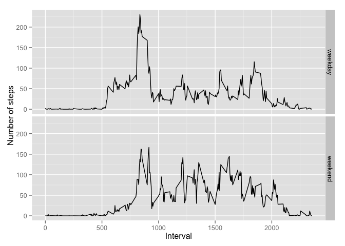

# Reproducible Research: Peer Assessment 1

## Loading and preprocessing the data

```r
activity <- read.csv("activity.csv")
```
## What is mean total number of steps taken per day?
1. Ignore the missing values in the dataset, calculate the total number of steps taken per day.

```r
totalSteps <- tapply(activity$steps, activity$date, sum)
```
2. Make a histogram of the total number of steps taken each day.

```r
hist(totalSteps, xlab='Total steps per day', main=NULL)
```

 

3. Calculate and report the mean and median of the total number of steps taken per day.

```r
mean(totalSteps, na.rm=T)
```

```
## [1] 10766.19
```

```r
median(totalSteps, na.rm=T)
```

```
## [1] 10765
```
## What is the average daily activity pattern?
1. Make a time series plot (i.e. type = "l") of the 5-minute interval (x-axis) and the average number of steps taken, averaged across all days (y-axis)

```r
avgSteps <- tapply(activity$steps, activity$interval, mean, na.rm=T)
plot(levels(as.factor(activity$interval)), avgSteps, type='n',
     main='Daily activity pattern', xlab='5 min interval', ylab='Average steps')
lines(levels(as.factor(activity$interval)), avgSteps)
```

 

2. Which 5-minute interval, on average across all the days in the dataset, contains the maximum number of steps?

```r
which.max(avgSteps) # returns the interval (835) followed by its index (104)
```

```
## 835 
## 104
```
## Imputing missing values
1. Calculate and report the total number of missing values in the dataset.

```r
sum(is.na(activity$steps))
```

```
## [1] 2304
```
2. Devise a strategy for filling in all of the missing values in the dataset. Use the mean for that 5-minute interval.

```r
# Populate a dummy vector with the same number of entries as the primary dataset
# using average values as previously calculated
dummy <- rep_len(avgSteps, length.out=nrow(activity))
```
3. Create a new dataset that is equal to the original dataset but with the missing data filled in.

```r
# Copy the original dataset, then replace NA values in first column with
# corresponding values from the dummy
activity2 <- activity
activity2$steps[is.na(activity$steps)] <- dummy[is.na(activity$steps)]
```
4. Make a histogram of the total number of steps taken each day and calculate and report the mean and median total number of steps taken per day. Do these values differ from the estimates from the first part of the assignment? What is the impact of imputing missing data on the estimates of the total daily number of steps?

```r
totalSteps2 <- tapply(activity2$steps, activity$date, sum)
hist(totalSteps2, xlab='Total steps per day', main=NULL)
```

 

```r
mean(totalSteps2)
```

```
## [1] 10766.19
```

```r
median(totalSteps2)
```

```
## [1] 10766.19
```
The mean is unchanged, since NA values were replaced with calculated means. The median is no longer an integer because NA values were not necessarily replaced with integers. Since NA values were replaced with means across all the days, the spread of the data has decreased.

## Are there differences in activity patterns between weekdays and weekends?
1. Create a new factor variable in the dataset with two levels – “weekday” and “weekend” indicating whether a given date is a weekday or weekend day.

```r
# Create a vector of weekdays ('Monday', 'Tuesday' etc.)
weekdays <- weekdays(as.Date(activity2$date))
# Add a new column to activities2, populated as 'weekday' by default
activity2$weekday <- factor('weekday', levels = c('weekday', 'weekend'))
# Relabel Saturdays and Sundays as 'weekend'
activity2$weekday[weekdays %in% c('Saturday', 'Sunday')] <- factor('weekend')
```
2. Make a panel plot containing a time series plot (i.e. type = "l") of the 5-minute interval (x-axis) and the average number of steps taken, averaged across all weekday days or weekend days (y-axis). See the README file in the GitHub repository to see an example of what this plot should look like using simulated data.

```r
library(ggplot2)
dat <- aggregate(activity2$steps,
                 by=list(activity2$interval, activity2$weekday), FUN=mean)
names(dat) <- c('Interval', 'weekday', 'Steps')
qplot(Interval, Steps, data=dat, facets=weekday~., geom='line', ylab='Number of steps')
```

 
